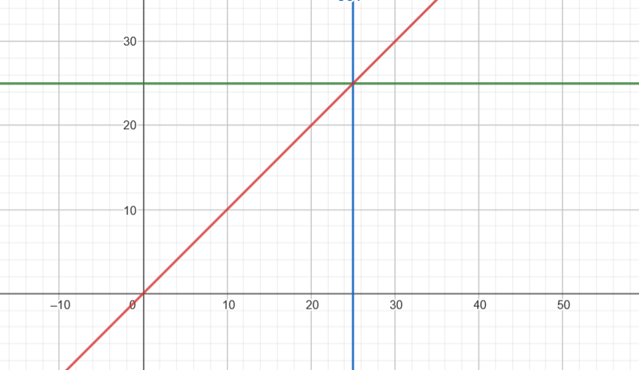
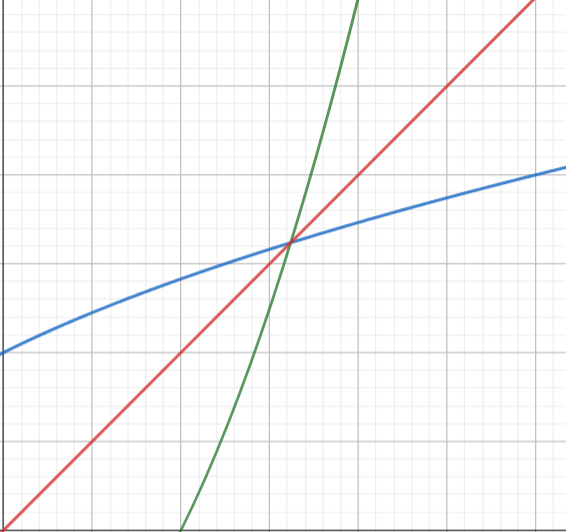
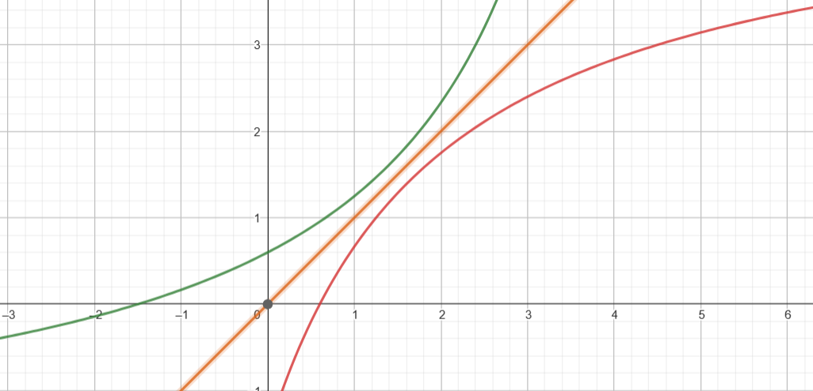
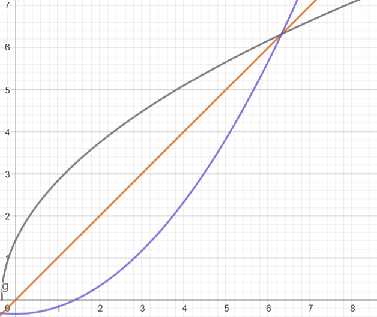
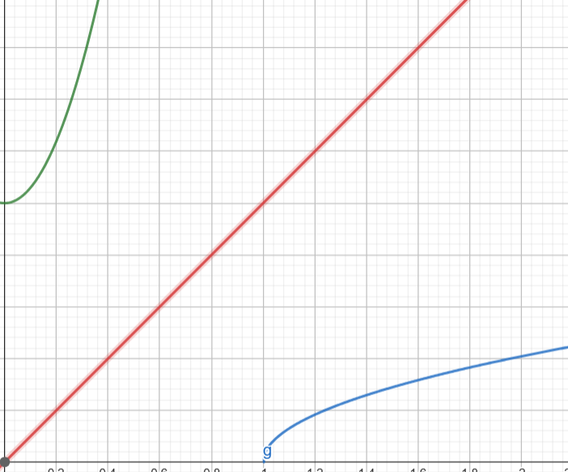

# Ejercicios

1. $p(x)=32-7$

    $$y=32-7$$

    Como la función es una resta numérica, se realiza:
    $$y=25$$

    Finalmente se intercambia la $x$ por la $y$:
    $$x=25$$

    Gráficamente se ve como sigue:

    

2. $m(x)=x^2-1$

    > IMPORTANTE: Para toda inversa de función, debe despejarse $x$, es decir, quitarle todo lo que tiene y dejarla "solita".

    $$m(x)=x^2-1$$
    $$y=x^2-1$$

    Comenzamos SIEMPRE quitando las operaciones más simples o de agrupación, en este caso, quitamos el $-1$, para esto sumamos $1$ en cada lado del $=$.

    $$y+1=x^2-1+1$$

    El objetivo de sumar $1$, es que se pueda restar y quedar $0$, en este caso $-1+1=0$, quedando como sigue:

    $$y+1=x^2$$

    Ahora bien, para dejar completamente sola a la $x$, hay que quitar ese exponente $2$ que tiene. Esto lo hacemos sacando la operación inversa, en este caso la raiz en ambos lados de la igualdad:

    $$\sqrt{y+1}=\sqrt{x^2}$$

    Con esta raiz, el exponente se elimina y sólo nos quedará $x$.

    $$\sqrt{y+1}=x$$

    Se intercambian las letras y queda finalmente como:

    $$y=\sqrt{x+1}$$

    Gráficamente se vería como sigue:

    

3. $f(x)=\frac{2x+3}{5-x}$

    Para resolver este ejercicio, notamos que la función es una fracción, por lo que ambos lados de la igualdad lo multiplicaremos por el denominador que es $5-x$.

    $$f(x)=\frac{2x+3}{5-x}$$
    $$y=\frac{2x+3}{5-x}$$
    $$y(5-x)={\frac{2x+3}{5-x}}(5-x)$$

    Esto hará que podamos eliminar el denominador, quedando así:

    $$y(5-x)={\frac{2x+3}{\bcancel{5-x}}}\bcancel{(5-x)}$$
    $$y(5-x)={2x+3}$$

    Ahora multiplicamos $y(5-x)$ quedando:

    $$5y-xy=2x+3$$

    como queremos sola a la $x$, le quitamos el $+3$, restando $3$ en ambos lados:

    $$5y-xy-3=2x+\bcancel{3}-\bcancel{3}$$
    $$5y-xy-3=2x$$

    Ahora bien, del lado izquierdo de la ecuación, tenemos también una $x$, por lo que hay que pasarla del otro lado para que todo esté OK, para esto, como $xy$ está restando, hay que sumar en ambos lado $xy$:

    $$5y-\bcancel{xy}+\bcancel{xy}-3=2x+xy$$
    $$5y-3=2x+xy$$

    Ahora se factoriza la $x$ en el lado derecho de la ecuación:

    $$5y-3=x(2+y)$$

    Hasta este punto ya tenemos la $x$ sola, lo que resta es quitarle el $(2+y) que la está multiplicando, esto se quita dividiendo por ese mismo paréntesis en ámbos lados de la ecuación:
    
    $$\frac{5y-3}{2+y}=\frac{x\bcancel{(2+y)}}{\bcancel{2+y}}$$
    $$\frac{5y-3}{2+y}=x$$

    Finalmente intercambiamos las variables y queda:

    $$y=\frac{5x-3}{2+x}$$

    Gráficamente se ve como sigue:

    

4. $y=\frac{1}{6}x^2-\frac{1}{3}$
   
   Para este ejercicio se elimina lo más sencillo, en este caso el $-\frac{1}{3}$ sumando esa fracción en ambos lados:

   $$y=\frac{1}{6}x^2-\frac{1}{3}$$
   $$y+\frac{1}{3}=\frac{1}{6}x^2-\bcancel{\frac{1}{3}}+\bcancel{\frac{1}{3}}$$
   $$y+\frac{1}{3}=\frac{1}{6}x^2$$

   Ahora lo que estorba es el $\frac{1}{6}$, por lo que multiplicarémos ambos lados por 6:

   $$6\left(y+\frac{1}{3}\right)=\frac{1}{\bcancel{6}}{x^2}(\bcancel{6})$$
   $$6\left(y+\frac{1}{3}\right)=x^2$$

   Ahora multiplicamos el lado derecho para simplificar:

   $$6y+\frac{6}{3}=x^2$$
   $$6y+2=x^2$$

   Finalmente para eliminar el $^2$ de la $x$, obtenemos la raíz cuadrada en ambos lados:

   $$\sqrt{6y+2}=\sqrt{x^{\bcancel{2}}}$$
   $$\sqrt{6y+2}=x$$

   Finalmente intercambiamos $x$ por $y$:

   $$y=\sqrt{6x+2}$$

   Gráficamente quedaría:

   

5. $y=6x^2+1$
   
   Quitamos primero el $-1$ que es el más fácil:

   $$y=6x^2+1$$
   $$y-1=6x^2+\bcancel{1}-\bcancel{1}$$
   $$y-1=6x^2$$

   Ahora quitamos el $6$ que está multiplicando:

   $$\frac{y-1}{6}=\frac{\bcancel{6}x^2}{\bcancel{6}}$$
   $$\frac{y-1}{6}=x^2$$

   Finalmente aplicamos raíz cuadrada en ambos miembros para eliminar el $^2$ de la $x$.

   $$\sqrt{\frac{y-1}{6}}=\sqrt{x^{\bcancel{2}}}$$
   $$\sqrt{\frac{y-1}{6}}=x$$

   Intercambiamos y listo:

   $$y=\sqrt{\frac{x-1}{6}}$$

   Gráficamente se ve así:

   