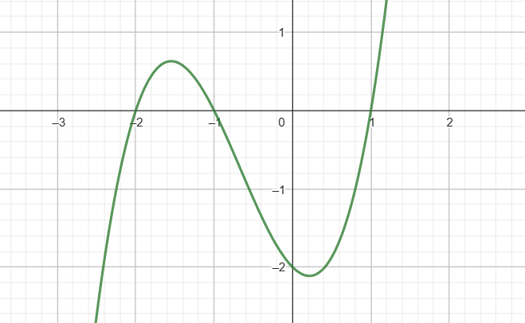
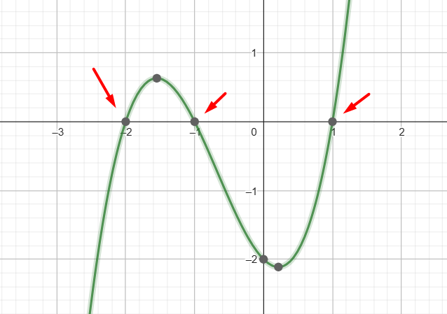
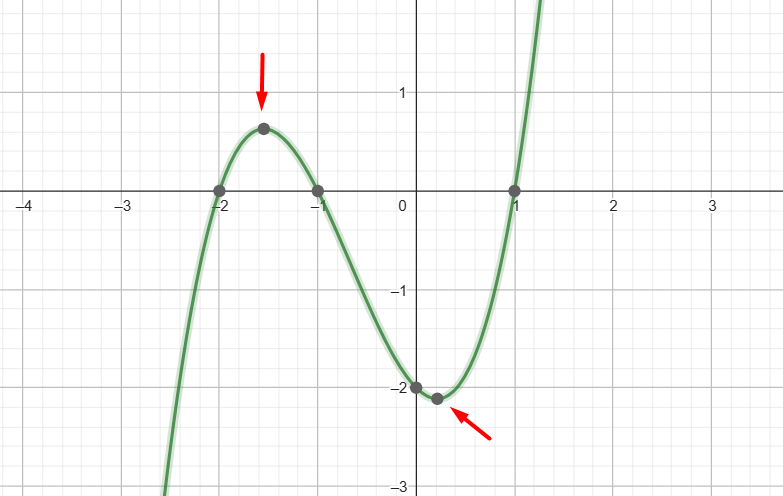
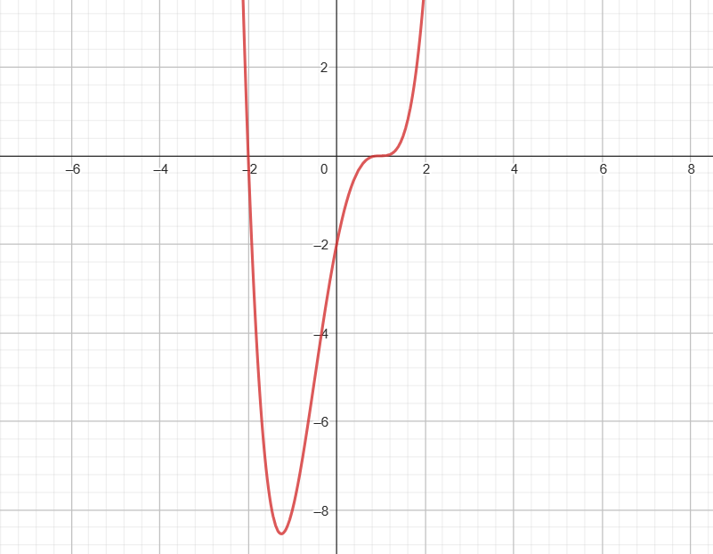
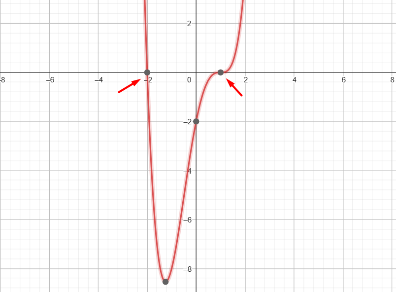
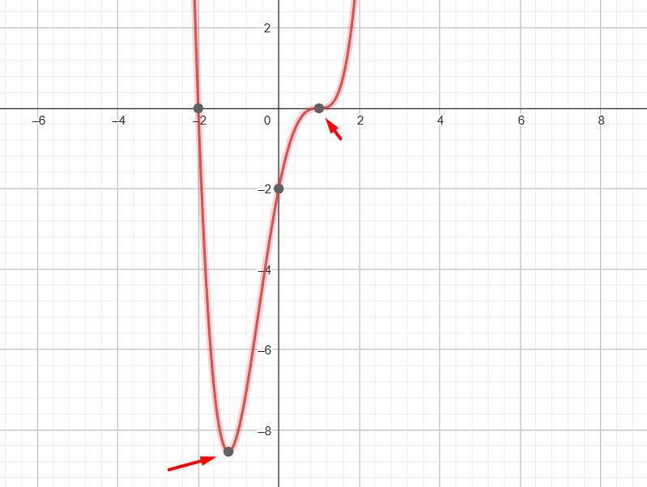

## Función de 3er grado

Una función de tercer grado, también conocida como función cúbica, es una función polinómica cuyo mayor exponente es $3$. La forma general de una función de tercer grado es:

$$f(x) = ax^3 + bx^2 + cx + d$$

Donde $a$, $b$, $c$ y $d$ son constantes que determinan las características específicas de la función.

Por ejemplo:

$$f(x)=x^3+2x^2-x-2$$

Donde $a=1$, $b=2$, $c=-1$ y $d=-2$.

Las características principales de una función de tercer grado son las siguientes:

1. **Dominio y rango**: El dominio de una función de tercer grado es el conjunto de todos los números reales, ya que la función está definida para cualquier valor de $x$. El rango puede ser cualquier conjunto de números reales, dependiendo de la concavidad de la función.

2. **Raíces o ceros**: Una función de tercer grado puede tener hasta tres raíces o ceros. Estas son los valores de $x$ para los cuales la función se anula, es decir, $f(x) = 0$. Las raíces pueden ser reales o complejas, y se pueden encontrar utilizando métodos algebraicos o gráficos.
   
   

3. **Concavidad**: La concavidad de una función de tercer grado puede variar. Si el coeficiente $a$ es positivo, la función será cóncava hacia arriba, mientras que si $a$ es negativo, la función será cóncava hacia abajo. La concavidad afecta la forma de la curva y cómo se comporta la función en diferentes intervalos.

4. **Puntos de inflexión**: Una función de tercer grado puede tener hasta dos puntos de inflexión, donde la concavidad cambia de cóncava hacia arriba a cóncava hacia abajo o viceversa. Los puntos de inflexión ocurren cuando la segunda derivada de la función se anula.
   
   

## Función de 4to grado

Una función de cuarto grado, también conocida como función cuártica, es una función polinómica cuya expresión general tiene el siguiente formato:

$$f(x) = ax^4 + bx^3 + cx^2 + dx + e$$

Donde $a$, $b$, $c$, $d$ y $e$ son constantes reales y $x$ es la variable independiente. 

Por ejemplo:

$$f(x)=x^4 - x^3 - 3 x^2 + 5 x - 2$$

Donde $a=1$, $b=-1$, $c=-3$, $d=5$ y $e=-2$

Algunas características importantes de las funciones de cuarto grado son las siguientes:

1. **Grado**: El grado de una función de cuarto grado es $4$, lo que significa que el término de mayor exponente en la expresión general es $x^4$.

2. **Forma general**: La forma general de una función de cuarto grado muestra que el polinomio tiene cinco términos, cada uno con un coeficiente correspondiente.

3. **Simetría**: Las funciones de cuarto grado pueden ser simétricas respecto al eje vertical (eje $y$ ) o al origen  $p(0,0)$. La simetría respecto al eje y ocurre si la función cumple con la propiedad $f(x) = f(-x)$. La simetría respecto al origen ocurre si la función cumple con la propiedad $f(x) = -f(-x)$.

4. **Número de raíces**: Una función de cuarto grado puede tener hasta cuatro raíces reales distintas. Estas raíces pueden ser puntos de intersección con el eje $x$, donde la función toma el valor cero.
   
   

5. **Comportamiento en el infinito**: A medida que $x$ se acerca al infinito positivo o negativo, el valor de la función también tiende al infinito positivo o negativo, respectivamente. Esto se debe a la presencia del término de mayor grado $x^4$ en la función.

6. **Puntos de inflexión**: Una función de cuarto grado puede tener hasta tres puntos de inflexión, donde la concavidad de la función cambia. Estos puntos de inflexión ocurren cuando la segunda derivada de la función se anula.
   
   

7. **Pendiente**: La pendiente de una función de cuarto grado puede variar ampliamente dependiendo de los valores de los coeficientes en la expresión general. La pendiente también puede cambiar en diferentes intervalos de la función.

Estas son algunas características generales de una función de cuarto grado. Sin embargo, es importante tener en cuenta que las propiedades específicas de una función de este tipo pueden variar según los valores de los coeficientes en la expresión general.